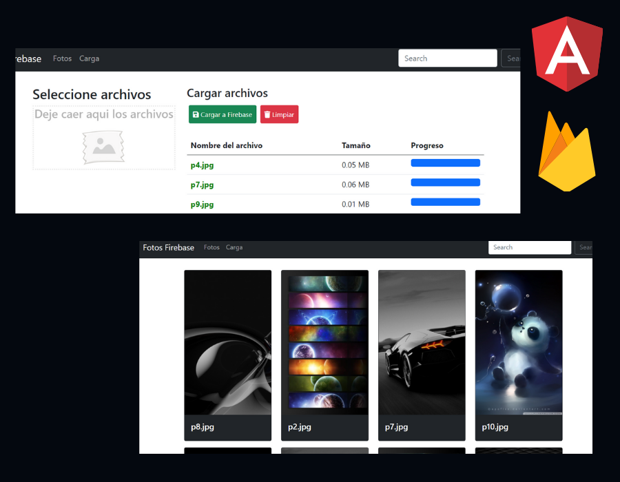

# Firebase Upload Imagenes

Ir a [FirebaseUploadImages](https://josesaldivarc.com/angular/firebase-images/).

Este proyecto fue generado con [Angular CLI](https://github.com/angular/angular-cli) _**version 10.0.7.**_

 

 

### **Tecnologías | Lenguajes de Programación | Herramientas | Frameworks | Librerias**

 

> -   Framework **Angular 10.0.7**
> -   Framework **Bootstrap 5 Beta**
> -   TypeScript
> -   Firebase

### **Caracterisiticas**

 

Carga de imagenes al storage de Firebase.

> -   Uso de directivas
> -   Hostlistener
> -   Input y Outputs
> -   Storage de Firebase
> -   uploadTask de Firebase
> -   Eventos drop, dragenter, dragleave, dragover
> -   Uso de tipo de dato File

 

### Autor

 

Desarrollado en el curso _**Udemy | Angular de 0 a Avanzado | Fernando Herrera**_

Realización de la practica: _**José Saldivar**_
